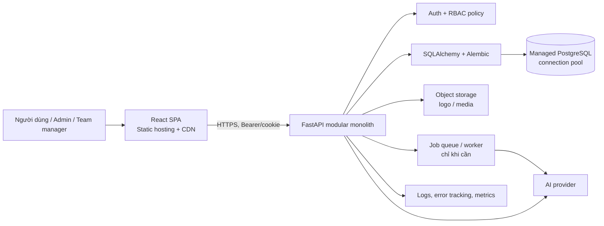
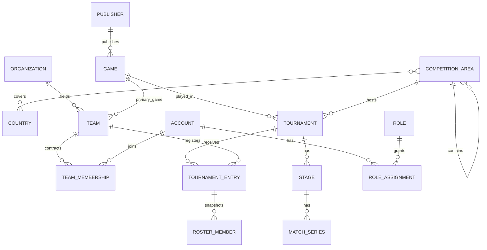

# Kế hoạch tái tổ chức nền tảng Esports

> Phiên bản: 1.0 · ngày 05/10/2026  
> Mục tiêu: đưa dự án từ MVP quản lý một đội/giải đấu thành nền tảng đa game, đa tổ chức, đa khu vực, có phân quyền theo phạm vi và có AI hỗ trợ vận hành.

## 1. Kết luận ngắn: nên bắt đầu ở đâu

Không nên làm ngay giao diện đẹp, AI chatbot hay tách microservice. Việc đầu tiên là **chốt mô hình nghiệp vụ và mô hình dữ liệu**, sau đó dựng lại nền tảng kỹ thuật có migration, phân quyền và môi trường triển khai. Nếu các phần này sai, mỗi tính năng mới sẽ phải sửa nhiều bảng, API và màn hình.

Thứ tự ưu tiên đề xuất:

1. Chốt glossary, phạm vi MVP và quyền của từng loại người dùng.
2. Chuyển database sang PostgreSQL là nguồn dữ liệu duy nhất; dùng migration thay cho file SQL chạy lại từ đầu.
3. Xây lại FastAPI thành modular monolith, có xác thực/RBAC theo phạm vi (scope).
4. Chuyển frontend sang **React + TypeScript**. Chưa thêm Vue vào cùng sản phẩm.
5. Hoàn thiện luồng quản trị: publisher → game → khu vực → tổ chức → đội → roster → giải → trận đấu.
6. Đưa lên staging rồi production với hạ tầng managed giá rẻ.
7. Chỉ tích hợp AI sau khi dữ liệu, quyền và nhật ký thao tác đã ổn định.

Mô hình khởi đầu phù hợp nhất là **modular monolith**: một API FastAPI, một PostgreSQL managed, một React SPA. Nó đủ rõ để 4 người cùng làm, rẻ để vận hành, và vẫn tách được thành worker/AI service sau này nếu tải tăng.

---

## 2. Đánh giá điểm xuất phát của repository hiện tại

Repository hiện đã có các phần hữu ích:

- `backend/`: FastAPI, JWT cơ bản, các route `auth` và `team`, kết nối PostgreSQL bằng `psycopg2`.
- `database/schema_postgres.sql`: các bảng `roles`, `users`, `teams`, membership, tournament, stage, match và standing.
- `frontend/`: hiện là HTML/JavaScript tĩnh gọi trực tiếp API; chưa phải một React app hoàn chỉnh dù có thư mục `src`.

Những giới hạn phải xử lý trước khi mở rộng:

- Một `teams` chưa thuộc tổ chức và chưa có quan hệ với game. Không thể biểu diễn một tổ chức có đội LoL, Valorant và FC.
- `users.role_id` chỉ cho một role toàn cục. Thực tế một người có thể là quản trị viên của tổ chức A, trọng tài ở giải B và chỉ là viewer ở nơi khác.
- Tournament chưa bắt buộc thuộc game, vùng thi đấu, mùa giải, đơn vị tổ chức hoặc venue.
- Ràng buộc “một người chỉ active ở một đội” không phù hợp đa game; người đó có thể là player LoL và coach Valorant, hoặc lịch sử khác nhau theo game.
- Schema hiện có `DROP TABLE ...`; tuyệt đối không dùng cách này cho staging/production. Không có version migration, seed tách môi trường, audit log, test hay cơ chế backup.
- `allow_origins=["*"]` kết hợp credential không phù hợp production; frontend đang giữ token trong `localStorage`, cần xác định lại chiến lược phiên đăng nhập và CORS.

Kết luận: dữ liệu hiện tại là dữ liệu MVP/legacy, cần **migrate có kiểm soát**, không sửa chắp vá từng bảng cũ.

---

## 3. Các quyết định kiến trúc cần chốt ngay

| Chủ đề | Quyết định đề xuất | Lý do |
| --- | --- | --- |
| Kiến trúc | Modular monolith FastAPI | Dễ deploy, debug và phân công; chưa cần chi phí/vận hành microservice. |
| Database | PostgreSQL là system of record duy nhất | Phù hợp dữ liệu quan hệ, transaction, constraint và báo cáo. |
| Lớp giữa API và PostgreSQL | SQLAlchemy 2.x + Alembic; Pydantic cho input/output | ORM/repository quản lý truy cập DB, Alembic version hóa schema. Không để browser truy cập DB trực tiếp. |
| Khóa chính | UUID cho entity public; có thể dùng `bigint` nội bộ nếu cần | Không dễ đoán ID trên URL/API và thuận tiện merge dữ liệu sau này. |
| Thời gian | `timestamptz`, lưu UTC; timezone đặt ở competition area/venue | Giải liên quốc gia không thể chỉ dùng `DATE` hoặc giờ local của server. |
| Frontend | React + TypeScript + Vite, một design system | Tập trung nguồn lực; tránh hai SPA trùng tính năng. |
| Vue | Chưa dùng trong MVP | Chỉ cân nhắc một Vue admin portal độc lập sau này nếu có đội riêng và API contract ổn định. Không trộn component React/Vue trên cùng màn hình. |
| API | REST `/api/v1`, OpenAPI là hợp đồng | FastAPI tự sinh OpenAPI, thuận lợi tạo typed client cho React. |
| Background jobs | Bắt đầu bằng bảng job + worker riêng khi có nhu cầu AI/import | Không đưa Redis/Celery vào trước khi thật sự có tác vụ chậm. |
| File media | Object storage (logo, avatar, evidence), chỉ lưu URL/metadata trong PostgreSQL | Filesystem của dịch vụ cloud thường ephemeral. |
| AI | Provider abstraction ở backend; AI không được tự ghi kết quả quan trọng | Đổi nhà cung cấp dễ hơn, giảm rủi ro AI sửa lịch/điểm/role sai. |

### Sơ đồ triển khai mục tiêu



**Nguyên tắc bảo mật quan trọng:** biến môi trường database và API key AI chỉ nằm ở backend/CI secret. React chỉ biết `VITE_API_BASE_URL`; không chứa `DATABASE_URL`, service key hoặc API key AI.

---

## 4. Ngôn ngữ nghiệp vụ chung (glossary)

Chốt các định nghĩa này trước khi đặt tên bảng/màn hình:

| Khái niệm | Ý nghĩa trong hệ thống |
| --- | --- |
| Publisher | Nhà phát hành hoặc đơn vị sở hữu/ủy quyền game; có nhiều game. |
| Game | Một tựa game cạnh tranh, ví dụ Valorant. Một game thuộc một publisher chính tại một thời điểm trong MVP. |
| Organization | Tổ chức esports/club/brand, ví dụ T1. Có thể sở hữu nhiều competitive team/division. |
| Team | Đội thi đấu theo game, ví dụ “T1 Valorant”. Thuộc một organization và một game chính. |
| Player profile | Hồ sơ thi đấu của account; account có thể có nhiều profile/alias theo game nếu sau này cần. |
| Roster | Danh sách người đại diện cho team ở **một tournament/season cụ thể**, là snapshot, không phải membership hiện tại. |
| Competition area | Khu vực thi đấu có phân cấp: global, liên quốc gia, quốc gia, địa phương. Khác với địa chỉ bưu chính. |
| Circuit/series | Chuỗi giải có thương hiệu, ví dụ “XYZ Championship”; có nhiều season và tournament/event. |
| Tournament | Một giải hoặc event diễn ra ở khoảng thời gian cụ thể, một game và một competition area. |
| Stage | Vòng bảng, playoffs, chung kết… trong tournament. |
| Match series | Cặp đấu (BO1/BO3/BO5). Có thể có map/game con nếu sau này cần. |
| Scope | Phạm vi hiệu lực của quyền: toàn hệ thống, publisher, game, area, country, organization hoặc tournament. |

Đặt tên tiếng Anh nhất quán trong code/database; UI có thể hiển thị tiếng Việt/Anh qua i18n. Không dùng một từ `region` cho cả địa lý, league và server game.

---

## 5. Phân quyền: nhiều bảng nhưng phải rõ ràng, không rối

### 5.1. Phân tách ba lớp quyền

1. **Role**: tên nhóm công việc, ví dụ `PLATFORM_ADMIN`, `TOURNAMENT_ADMIN`, `REFEREE`.
2. **Permission**: hành động rất cụ thể, ví dụ `tournament.update`, `match.report_score`, `organization.manage_team`.
3. **Role assignment + scope**: ai có role nào, ở phạm vi nào và trong khoảng thời gian nào.

Không kiểm tra kiểu `if user.role == 'ADMIN'` rải trong route. Mỗi endpoint khai báo permission yêu cầu, dependency của FastAPI sẽ xét role assignment và scope.

### 5.2. Bộ role khởi đầu

| Role | Scope hợp lệ | Quyền chính |
| --- | --- | --- |
| `PLATFORM_SUPER_ADMIN` | system | Quản trị toàn bộ, chỉ 1–2 người tin cậy. |
| `PLATFORM_OPERATOR` | system | Vận hành catalog, support, không tự cấp super admin. |
| `PUBLISHER_ADMIN` | publisher / game | Quản game, rule template, duyệt giải thuộc publisher. |
| `AREA_ADMIN` | competition area / country | Quản giải và venue trong khu vực. |
| `ORGANIZATION_OWNER` | organization | Quản organization, team, manager. |
| `TEAM_MANAGER` | team hoặc organization | Quản roster, đăng ký giải, nộp tài liệu. |
| `COACH` | team | Xem/quản roster được cấp; không đổi quyền tài chính. |
| `PLAYER` | team | Xem lời mời, xác nhận roster, hồ sơ của mình. |
| `TOURNAMENT_ADMIN` | tournament | Tạo stage, schedule, duyệt entry, quản trị giải. |
| `REFEREE` | tournament / stage | Báo cáo/duyệt kết quả match theo phân công. |
| `CONTENT_MODERATOR` | system / area | Kiểm duyệt nội dung, không quản lý quyền/điểm. |
| `VIEWER` | system | Quyền public/read-only mặc định. |

Một account có thể đồng thời có nhiều role. Role có hiệu lực phải có `starts_at`, `ends_at`, `assigned_by`; mọi thay đổi quyền ghi audit log. Không cho client truyền `role_id` tùy ý khi đăng ký.

### 5.3. Quy tắc kiểm tra quyền

Ví dụ `PATCH /tournaments/{id}`:

- Lấy tournament → `game_id`, `competition_area_id`, `organizer_organization_id`.
- Cho phép nếu có `tournament.update` ở `SYSTEM`, chính tournament, area cha của tournament, game của tournament, hoặc organization tổ chức (tùy policy đã định).
- Log actor, action, entity, dữ liệu trước/sau ở mức an toàn.

Đây là lý do scope phải nằm trong database thay vì chỉ để frontend ẩn nút.

---

## 6. Mô hình dữ liệu PostgreSQL đích

### 6.1. Quy ước chung

- Dùng schema PostgreSQL: `identity`, `catalog`, `geo`, `org`, `competition`, `audit` (có thể bắt đầu tất cả trong `public` nếu nhóm mới, nhưng module phải tách rõ trong code). Không để quyền truy cập phụ thuộc vào tên schema.
- Hầu hết bảng nghiệp vụ: `id uuid primary key`, `created_at timestamptz not null`, `updated_at timestamptz not null`, `created_by`; những entity cần khôi phục có `archived_at` thay vì hard delete.
- Dùng enum PostgreSQL có cân nhắc: trạng thái cực ổn định có thể enum; trạng thái còn hay đổi thì `varchar` + `CHECK`/reference table để migration nhẹ hơn.
- Tất cả FK có index (PostgreSQL không tự tạo index FK). Index theo query thực tế, không tạo bừa.
- Money là `numeric(14,2)` + `currency char(3)`, không dùng `float`.
- `slug` unique theo phạm vi hợp lý; định danh public không dựa vào tên.
- Chỉ dùng `ON DELETE CASCADE` cho child không thể tồn tại độc lập (ví dụ stage của tournament). Dữ liệu match, quyền và audit không cascade xóa lặng lẽ.

### 6.2. Nhóm bảng và quan hệ



#### A. Identity và RBAC

| Bảng | Cột/ràng buộc chính | Ghi chú |
| --- | --- | --- |
| `accounts` | `id`, email unique (case-insensitive), username, password_hash, status, last_login_at | Account đăng nhập; không mặc định là player. Dùng `citext` cho email/username nếu bật extension. |
| `profiles` | `account_id` unique, display_name, avatar_object_key, locale | Thông tin public có thể tách khỏi credential. |
| `roles` | code unique, name, scope_type | Role là nhóm permission, không chứa logic trong code. |
| `permissions` | code unique, description | Ví dụ `team.invite_member`. |
| `role_permissions` | `(role_id, permission_id)` PK | Many-to-many. |
| `role_assignments` | account, role, nullable FKs tới publisher/game/area/organization/team/tournament, starts/ends | Một assignment chỉ có **0 hoặc 1** target scope; 0 là system. `CHECK` số scope không vượt 1. Service kiểm role được gán đúng scope_type. |
| `auth_sessions` / `refresh_tokens` | hash token, expired/revoked, device metadata | Cần nếu dùng refresh token/cookie. Không lưu refresh token dạng thô. |

#### B. Catalog game

| Bảng | Cột/ràng buộc chính |
| --- | --- |
| `publishers` | `id`, legal_name, display_name, slug unique, website, status |
| `games` | `id`, `publisher_id`, name, slug unique, game_code unique, platform, status, released_at |
| `game_versions` | game, version code/name, released_at, active_from/to; phục vụ luật theo patch nếu cần |
| `game_rule_sets` | game, version, title, document URL, effective dates, status |

Không hard-code danh sách game trong frontend. `publisher_id` ở `games` chính là quan hệ “một nhà phát hành có nhiều game”. Nếu sau này cần đồng phát hành theo vùng, thêm `game_publishers` có `country/area` và thời hạn; không thêm sớm.

#### C. Địa lý và vùng thi đấu

| Bảng | Cột/ràng buộc chính |
| --- | --- |
| `countries` | ISO 3166-1 alpha-2 PK/code, name, default_timezone |
| `competition_areas` | id, parent_area_id self-FK, code unique, name, `area_level` (`GLOBAL`, `MULTI_COUNTRY`, `COUNTRY`, `LOCAL`), country_code nullable, timezone, active |
| `competition_area_countries` | area_id + country_code PK; dùng cho area liên quốc gia |
| `venues` | area, country, name, address, latitude/longitude nullable, timezone |

Ví dụ: `GLOBAL` → `APAC` (MULTI_COUNTRY, gồm VN/TH/SG) → `VN` (COUNTRY) → `VN-HCM` (LOCAL). Khi chọn giải, tournament trỏ tới một area; API có thể tìm ancestor để áp quyền AREA_ADMIN. Không suy diễn quốc gia từ tên vùng.

#### D. Tổ chức, đội và con người

| Bảng | Cột/ràng buộc chính |
| --- | --- |
| `organizations` | id, name, slug unique, legal/country info, logo, status |
| `organization_members` | organization, account, member_type, joined/left; giữ lịch sử quan hệ với tổ chức |
| `teams` | id, organization_id, game_id, name, tag, slug, team_kind (`MAIN`, `ACADEMY`, `WOMEN`, `COMMUNITY`), status |
| `team_memberships` | team, account, position (`PLAYER`, `COACH`, `ANALYST`, `MANAGER`, `SUBSTITUTE`), joined/left, status |
| `player_game_profiles` | account, game, in_game_name, external_player_id, country, visibility |

Ràng buộc đề xuất: unique `(organization_id, game_id, tag)`; partial unique cho một `PLAYER` active trên cùng game theo chính sách của nền tảng. Không áp một unique active trên mọi đội như schema cũ. Team membership là quan hệ dài hạn, **không** được dùng để tái tạo roster lịch sử của giải.

#### E. Giải đấu và kết quả

| Bảng | Cột/ràng buộc chính |
| --- | --- |
| `competition_series` | game, organizer organization, publisher optional, area, name, slug, status |
| `seasons` | series, name, sequence, starts_at, ends_at, status |
| `tournaments` | season nullable, game, organizer, area, venue nullable, title, slug, format, max_teams, starts_at, ends_at, timezone, status, rule_set |
| `stages` | tournament, name, sequence, stage_type, format, starts/ends |
| `tournament_entries` | tournament, team, status (`PENDING`, `APPROVED`, `REJECTED`, `WITHDRAWN`), seed, registered_by; unique tournament+team |
| `tournament_rosters` | tournament_entry, account, role, in_game_name snapshot, is_captain, approved_at; unique entry+account |
| `match_series` | tournament, stage, round, bracket position, scheduled_at, best_of, home/away entry, winner entry, status |
| `match_games` | match_series, game_no, map/mode, scores, winner entry; chỉ thêm khi game cần BOx/map score |
| `match_officials` | match_series, account, responsibility |
| `standings` | tournament/stage, entry, rank, played/win/loss/points; snapshot hoặc materialized view tùy format |
| `score_reports` | match_series, reporter, source, payload JSONB, status, approved_by; lưu lịch sử trước khi ghi điểm chính thức |

`team_id` trong trận nên thông qua `tournament_entry_id`: điều này giữ đúng team/roster tại thời điểm giải, kể cả đội đổi tên hay membership thay đổi về sau. `JSONB` chỉ dùng cho payload riêng của game, không thay các cột truy vấn thường xuyên.

#### F. Vận hành, AI và kiểm toán

| Bảng | Cột/ràng buộc chính |
| --- | --- |
| `audit_logs` | actor_account_id nullable, action, entity_type/id, scope, request_id, before/after JSONB đã lọc secret, IP hash, created_at |
| `notifications` | recipient, type, payload, read_at, delivery state |
| `uploaded_assets` | owner/scope, object key, content type, size, checksum, scan status |
| `ai_conversations` | owner, scope, title, retention policy |
| `ai_messages` | conversation, role, content/redacted content, model/provider, token usage, status |
| `ai_jobs` | requested_by, job_type, input reference, result JSONB/object key, status, idempotency key, error, created/finished |
| `moderation_cases` | source entity, reason, AI suggestion, human decision, reviewer |

### 6.3. Chỉ mục, constraints và transaction phải có

- `accounts(email)`, `accounts(username)`, mọi FK, `(tournament_id, sequence_order)` ở stage, `(stage_id, round_no)`/bracket position và `(match_series_id, game_no)` là index/unique cần xem xét.
- Partial indexes: membership active, entry pending, tournament public/upcoming, role assignment currently valid.
- Constraint `start_at <= end_at`; `winner_entry_id` phải là một trong hai participant; hai participant không được trùng khi đều khác null. Một số constraint liên bảng thực thi qua transaction/service hoặc trigger có test, không cố nhồi vào frontend.
- Dùng `SELECT ... FOR UPDATE` hoặc optimistic version khi hai trọng tài cùng nộp kết quả; không cập nhật score bằng read-modify-write không khóa.
- Transaction cho: duyệt entry + khóa roster; ghi kết quả + cập nhật bracket/standing; chuyển role + audit log.

---

## 7. Chiến lược migration từ database hiện tại

Không thay file schema hiện tại rồi chạy trên database có dữ liệu. Làm theo pipeline sau:

1. **Đóng băng schema cũ và sao lưu**: dump PostgreSQL, kiểm tra phục hồi được vào database khác, ghi checksum/thời điểm backup.
2. **Tạo Alembic** trong `backend/`; migration đầu tiên tạo bảng mới với `revision` rõ ràng. Bỏ hoàn toàn `DROP TABLE` khỏi quy trình deploy.
3. **Tạo catalog tối thiểu**: `Legacy Publisher` và `Legacy/Unspecified Game` chỉ để migrate kỹ thuật, kèm report bắt buộc người quản trị mapping game thật trước khi public tournament.
4. **Migrate có mapping**:

   | Dữ liệu cũ | Đích mới | Xử lý cần quyết định |
   | --- | --- | --- |
   | `roles`, `users` | `accounts`, `profiles`, roles/RBAC | Map role cũ sang permission; reset/session rotation khi đổi auth. |
   | `teams` | `organizations` + `teams` | Tạo organization `Legacy independent` khi chưa biết chủ sở hữu; cần admin bổ sung game/tổ chức. |
   | `team_memberships` | `team_memberships`, `player_game_profiles` | Chỉ tạo active contract khi dữ liệu hợp lệ; giữ lịch sử. |
   | `tournaments`, `stages`, `matches` | tournament/stage/match series | Gắn `Legacy/Unspecified Game` và area legacy; đưa vào hàng đợi mapping thủ công. |
   | `tournament_rosters`, standings | entry + roster + standings | Sinh entry cho mỗi cặp tournament/team trước. |

5. **Chạy dry-run trên bản copy**: so sánh số lượng, bản ghi không map được, FK bị mồ côi, các giải không có game/area. Xuất CSV lỗi để product owner quyết định.
6. **Dual-read ngắn hạn hoặc maintenance window**: với MVP nhỏ, chọn maintenance window vài giờ sẽ an toàn và đơn giản hơn dual-write. Dừng ghi, backup cuối, migrate, chạy smoke test, chuyển API mới.
7. **Rollback rõ ràng**: nếu smoke test lỗi, quay API về version cũ và restore/giữ database cũ read-only; không tự chạy migration xuống nếu migration có đổi dữ liệu khó đảo.

Migration không hoàn thành nếu chỉ “chạy không lỗi”; phải có báo cáo đối soát: tổng accounts, teams, memberships, tournaments, stages, matches, rosters và số record cần bổ sung thủ công.

---

## 8. Thiết kế lại FastAPI

### 8.1. Cấu trúc thư mục mục tiêu

```text
backend/
  app/
    main.py
    core/                 # config, logging, security, exception handlers
    db/                   # engine, session, base, migration helpers
    api/v1/               # router chỉ điều phối HTTP
    modules/
      identity/           # models, schemas, repository, service, policies
      catalog/
      geography/
      organizations/
      competitions/
      audit/
      ai/
    workers/              # chỉ chạy process riêng khi đã có async job
  alembic/
  tests/
  pyproject.toml or requirements/
  Dockerfile
```

Không cần ép mọi module thành đủ năm layer nếu chỉ có CRUD đơn giản. Nhưng route không viết SQL trực tiếp và policy không nằm trong React/controller. Một use case phức tạp nên đi theo `router → service/use-case → repository/unit of work`.

### 8.2. Thư viện/cấu hình nên bổ sung

- SQLAlchemy 2.x, Alembic, driver PostgreSQL tương thích async hoặc sync nhất quán.
- `pydantic-settings` cho config có kiểu; `.env` chỉ cho local, production dùng secret của platform.
- `pytest`, HTTP test client, factory/fixture, test database độc lập.
- Password hash hiện đại qua thư viện được duy trì; JWT access ngắn hạn + refresh rotation/revocation hoặc secure HttpOnly cookie tùy UI domain.
- Structured logging có `request_id`, user/actor id (không log token/password), error tracking.
- Rate limit cho login, register, AI và upload; validation MIME/size của file.

### 8.3. API MVP cần có

| Nhóm | Endpoint minh họa | Permission |
| --- | --- | --- |
| Auth | `POST /auth/register`, `/login`, `/refresh`, `/logout`, `/password-reset` | public / owner |
| Catalog | `GET /publishers`, `POST /publishers`; `GET/POST /games` | public read, catalog manage write |
| Geography | `GET /competition-areas`; CRUD area/country/venue | public read, area admin |
| Organization | CRUD organization; invite member; CRUD team | owner/organization scoped |
| Competition | CRUD series/season/tournament/stage | tournament/area/game scoped |
| Entry & roster | register team, approve/reject, submit/lock roster | team manager / tournament admin |
| Match | schedule, assign referee, submit score, approve result, standings | referee/admin scoped |
| Audit | `GET /audit-logs` có filter scope | limited admin only |
| AI | `POST /ai/jobs`, `GET /ai/jobs/{id}`, feedback | authenticated + feature/usage policy |

Quy ước HTTP: pagination cursor hoặc `limit/offset` nhất quán, filter/sort whitelist, lỗi theo một schema `{code, message, details, request_id}`, idempotency key cho tạo entry/job, và OpenAPI được kiểm tra trong CI để không breaking API vô ý.

### 8.4. Bảo mật cần hoàn thành trước public beta

- CORS allowlist domain staging/production, không `*` cùng credential.
- Password hash, token expiration, refresh revoke; không lưu password/API key trong repo hay log.
- Kiểm quyền ở backend với test negative (người không có quyền phải bị 403), không tin role từ `localStorage`.
- Rate-limit login/AI; giới hạn upload; quét/kiểm tra file trước public URL nếu có thể.
- Backup database định kỳ và thử restore; migration chạy qua CI/release procedure.
- Audit những thao tác quyền, roster lock, match result, publish/unpublish và AI action có ảnh hưởng dữ liệu.

---

## 9. Frontend: React trước, Vue sau nếu thật sự có lý do

### 9.1. Lựa chọn đề xuất

Xây mới `frontend/` thành React + TypeScript + Vite, không cố biến vài file JS hiện có thành React từng phần. Giữ bản HTML cũ ở branch/tag hoặc `frontend-legacy/` tạm thời để tham chiếu, rồi bỏ khi migration hoàn tất.

Lý do chưa dùng Vue: hai framework nghĩa là hai bộ router, form, state, test, component, kỹ năng và bug surface. Với nhóm 4 người, lợi ích không bù chi phí. Nếu sau này cần Vue, giới hạn nó ở **một ứng dụng admin tách riêng** gọi cùng REST API; chia sẻ design token và API contract, không chia sẻ component trực tiếp.

### 9.2. Các khu vực màn hình MVP

1. Public: home, danh sách game/publisher, area, giải, bracket/schedule, team, organization, standing.
2. Account: đăng ký, đăng nhập, profile, notification.
3. Organization workspace: organization profile, team/game, membership, lời mời, roster, đăng ký giải.
4. Tournament workspace: cấu hình giải/stage, entry approval, roster lock, schedule, match control, referee assignment, standings.
5. Platform admin: catalog, geographic hierarchy, role assignment, audit logs, moderation/AI jobs.

Mỗi màn hình có ba trạng thái bắt buộc: loading, empty, error/forbidden. Không render menu dựa vào role lưu ở browser như nguồn chân lý; gọi `GET /me` và `GET /me/permissions`/capability của resource, rồi backend vẫn là nơi chặn cuối.

### 9.3. Chuẩn frontend

- API client sinh từ OpenAPI hoặc có type/schema dùng chung; không `fetch` URL rải trong component.
- React Router, query/cache layer cho server state, form validation, component primitives và design tokens.
- Accessiblity tối thiểu: label form, keyboard navigation, focus, contrast, responsive mobile/tablet.
- Test ít nhất cho luồng login, tạo team, đăng ký/duyệt entry, nộp điểm và 403 quyền sai.
- Environment: `VITE_API_BASE_URL`; staging/prod tách biến môi trường, không commit `.env` thật.

---

## 10. AI: làm chức năng có ích, có hàng rào an toàn

AI là lớp hỗ trợ quyết định và tự động hóa có kiểm duyệt; không phải core source of truth. Chỉ mở AI sau Phase 1 khi account, scope, audit và dữ liệu giải đã ổn định.

### 10.1. Thứ tự tính năng AI

| Ưu tiên | Tính năng | Input/Output | Human-in-the-loop |
| --- | --- | --- | --- |
| P1 | Trợ lý hướng dẫn admin/team manager | Docs, rule set và dữ liệu được phép theo scope; trả lời kèm nguồn nội bộ | Người dùng tự quyết; AI chỉ read-only. |
| P1 | Tóm tắt giải/trận và tạo draft thông báo | Match data có cấu trúc → bản nháp Việt/Anh | Admin preview, sửa và publish. |
| P1 | Trích xuất dữ liệu từ form/tài liệu roster | File đã kiểm tra → field có confidence | Manager xác nhận trước khi ghi DB. |
| P2 | Gợi ý lịch thi đấu | Availability, venue, timezone, ràng buộc → nhiều phương án | Tournament admin chọn/áp dụng, transaction validation. |
| P2 | Hỗ trợ moderation nội dung | Nội dung public → score/lý do | Moderator ra quyết định cuối. |
| P3 | Phân tích dự đoán/insight | Historical stats đủ chất lượng | Gắn nhãn prediction, không dùng chấm điểm/thưởng tự động. |

Không làm trước: bot tự cấp role, tự khóa account, tự duyệt kết quả, tự thay đổi bracket, hay lấy dữ liệu riêng của organization A để trả lời cho organization B.

### 10.2. Kiến trúc AI tối thiểu

1. Route AI xác thực user và kiểm permission/scope trước khi lấy context.
2. Service `AIProvider` có interface ổn định (`generate_text`, `generate_structured`, `embed` nếu cần). API key chỉ trên server.
3. Gửi instruction cố định + context đã lọc theo scope + prompt người dùng; hạn chế token/file/type rõ ràng.
4. Với tác vụ lâu, tạo `ai_jobs` idempotent rồi worker chạy; frontend poll/subscription trạng thái. Không giữ HTTP request treo.
5. Output cấu trúc bằng JSON schema/Pydantic, validate lần nữa trước khi hiển thị hoặc tạo draft.
6. Lưu metadata/audit: actor, scope, purpose, provider/model, chi phí/token nếu có, trạng thái; chính sách retention để không giữ PII không cần thiết.

### 10.3. Rủi ro AI và cách giảm

- **Leak dữ liệu xuyên scope:** context builder query bắt buộc filter permission; integration test hai organization không đọc được nhau.
- **Hallucination:** UI ghi “AI gợi ý”, hiển thị source/context và yêu cầu preview khi action có hiệu lực.
- **Prompt injection từ tài liệu:** coi file, comment, website là dữ liệu không tin cậy; instruction hệ thống tách riêng; không cho tool gọi ghi DB tự do.
- **Chi phí/bị spam:** quota theo account/org, rate limit, max context, caching kết quả an toàn và kill switch theo provider.
- **Dữ liệu cá nhân:** gửi mức tối thiểu, che email/token/contact; có thông báo và cơ chế xóa dữ liệu theo chính sách.

---

## 11. Hạ tầng giá rẻ/free và cách deploy

### 11.1. Topology khuyên dùng cho beta

| Thành phần | Lựa chọn beta | Ghi chú |
| --- | --- | --- |
| Frontend React | Static hosting/CDN như Cloudflare Pages hoặc Render Static Site | Build artifact tĩnh, domain riêng và HTTPS. |
| FastAPI | Render Web Service free cho demo/staging; instance trả phí nhỏ khi public beta cần phản hồi ổn định | Container chạy `uvicorn`/process manager, health endpoint `/health`. |
| PostgreSQL | Supabase/Neon managed PostgreSQL cho dev/beta; chọn plan trả phí khi dữ liệu quan trọng | Dùng connection pooler và backup/export định kỳ. |
| Object storage | Storage của managed platform hoặc S3-compatible object storage | Không lưu media vào filesystem API. |
| CI | GitHub Actions | Lint, test, build, migration check, deploy theo environment. |
| Monitoring | Platform logs + error tracking free tier ban đầu | Tách alert production ra email/nhóm phụ trách. |

**Không dùng database miễn phí của Render cho production.** Theo tài liệu Render, free PostgreSQL hết hạn sau 30 ngày và không có backup; free web service ngủ sau 15 phút không có traffic, lần đánh thức kế tiếp mất khoảng một phút. Nó hợp demo/staging, không hợp hệ thống giải đấu đang diễn ra. [Render – Deploy for Free](https://render.com/docs/free)

Supabase free hiện ghi rõ database 500 MB, 1 GB file storage và project bị pause sau một tuần không hoạt động; phù hợp development/hobby beta, nhưng phải theo dõi giới hạn và chuẩn bị nâng plan/backup trước khi có dữ liệu thực. [Supabase Pricing](https://supabase.com/pricing)

Giới hạn/gói miễn phí thay đổi theo thời gian, nên kiểm tra lại trước khi nhập thẻ hoặc launch. Chi phí production tối thiểu nên ưu tiên theo thứ tự: database backup/reliability → API luôn thức → monitoring/storage. Đừng tối ưu vài đô nếu mất dữ liệu kết quả giải.

### 11.2. Quy trình môi trường

| Environment | Mục đích | Quy tắc |
| --- | --- | --- |
| Local | Mỗi lập trình viên phát triển | Docker Compose PostgreSQL, fake/test AI provider, dữ liệu seed không thật. |
| CI | Test tự động | Database tạm; chạy migration từ đầu và test. |
| Staging | QA/PO duyệt trước release | Database riêng, domain riêng, có seed demo; không dùng production secret. |
| Production | Người dùng thật | Database riêng, backup/restore drill, secrets riêng, deploy có rollback. |

### 11.3. Các artifact cần tạo

- `docker-compose.yml`: API + PostgreSQL local, volume local, tùy chọn worker.
- `backend/Dockerfile`: image không chứa `.env`, chạy user không phải root nếu khả thi.
- `infra/render.yaml` hoặc config tương đương: khai báo service, health check, build/start command (không commit secret).
- `.github/workflows/ci.yml`: lint → unit/integration test → build frontend/API → migration validation.
- `.env.example` và `frontend/.env.example`: chỉ tên biến/giá trị giả.
- Runbook `docs/DEPLOYMENT.md`, `docs/BACKUP_RESTORE.md`, `docs/INCIDENT.md`.

### 11.4. Release an toàn

1. PR cần review và CI xanh.
2. Deploy staging, chạy smoke test luồng login → tạo/duyệt team entry → result → bracket.
3. Backup production, kiểm tra migration tương thích backward nếu deploy rolling.
4. Deploy migration theo quy trình đã viết; không chạy seed demo lên production.
5. Health check, kiểm log/error rate, test một user có từng scope quyền.
6. Nếu lỗi: rollback API image; database migration chỉ rollback khi đã có script/lý do an toàn, nếu không forward-fix theo runbook.

---

## 12. Lộ trình tính năng theo phase

### Phase 0 — Chốt thiết kế và nền móng (tuần 1–2)

**Mục tiêu:** cả nhóm thống nhất dữ liệu/quyền và có thể chạy dự án chuẩn hóa ở máy bất kỳ.

- [ ] Duyệt glossary, ERD, permission matrix và MVP scope trong tài liệu này.
- [ ] Quyết định một frontend framework: React + TypeScript; viết ADR ngắn cho các quyết định lớn.
- [ ] Khởi tạo Docker Compose, `.env.example`, format/lint/pre-commit, CI test rỗng.
- [ ] SQLAlchemy/Alembic, test DB, migration baseline; không deploy schema `DROP TABLE`.
- [ ] Auth hardening tối thiểu, `/health`, config typed, CORS theo environment.
- [ ] Thiết lập staging database/API/frontend và secrets.

**Exit criteria:** clone repo → một lệnh chuẩn chạy local; CI chạy; staging có health; migration chạy từ database trống.

### Phase 1 — Core platform data và RBAC (tuần 3–5)

**Mục tiêu:** quản được catalog, area, organization, team/game và quyền scoped.

- [ ] Accounts/profiles, roles/permissions/assignments, audit log.
- [ ] Publishers/games, competition areas/countries, organizations/teams/player profiles.
- [ ] Admin API/UI CRUD với validation, search, pagination, archived state.
- [ ] Migration/dry-run dữ liệu legacy + report mapping.
- [ ] React app shell: auth, layout, route guard/capability, error/empty/loading.

**Exit criteria:** user có role ở organization A không thể thay đổi organization B; một publisher có nhiều game; organization có nhiều team thuộc game khác nhau.

### Phase 2 — Tournament operation MVP (tuần 6–8)

**Mục tiêu:** chạy được một giải một game từ mở đăng ký đến kết quả.

- [ ] Series/season/tournament/stage/entry/roster/match series/standing.
- [ ] Luồng team manager đăng ký → tournament admin duyệt → lock roster.
- [ ] Bracket/schedule cơ bản theo một format đầu tiên (ví dụ single elimination hoặc round robin). Đừng làm mọi format cùng lúc.
- [ ] Referee nộp điểm, admin duyệt; audit log và cập nhật standings/bracket transactionally.
- [ ] Public tournament/team pages; test E2E luồng chính.

**Exit criteria:** dữ liệu roster lịch sử vẫn đúng sau khi player rời team; điểm cần đúng permission để cập nhật; public đọc được kết quả hợp lệ.

### Phase 3 — Vận hành, đa vùng và production beta (tuần 9–10)

**Mục tiêu:** sẵn sàng public beta nhỏ.

- [ ] Timezone, venue, notification email/in-app tối thiểu, upload logo/tài liệu qua object storage.
- [ ] Search/filter, activity/audit UI, backup/restore rehearsal, monitoring/error alert.
- [ ] Performance/index review với dữ liệu seed lớn; security checklist; deploy domain/custom TLS.
- [ ] Import/export CSV có validation nếu cần vận hành thực tế.

**Exit criteria:** khôi phục bản backup thử thành công; staging/production tách biệt; không có secret trong repo; có runbook khi API/DB lỗi.

### Phase 4 — AI assist (tuần 11–12, sau beta)

**Mục tiêu:** một AI feature tạo giá trị nhưng không phá quy trình vận hành.

- [ ] Provider abstraction, quota, audit/retention, job mechanism.
- [ ] Chọn **một** use case P1: AI tạo draft thông báo/tóm tắt kết quả hoặc hỏi đáp rule theo scope.
- [ ] Evaluation set tiếng Việt/Anh, test permission leakage, feedback button và kill switch.
- [ ] Chỉ release sau khi admin preview/approve được mọi output có tác động public.

---

## 13. Phân công cho nhóm 4 người

Mỗi người là owner một domain rõ ràng, nhưng PR phải review chéo. Không phân công theo file kiểu “A làm backend, B làm frontend” vì mọi người sẽ dồn vào nhau ở cuối sprint.

| Người | Vai trò owner | Trách nhiệm chính | Deliverable phase 0–2 |
| --- | --- | --- | --- |
| **Người 1** | Tech lead / Data & Identity | Kiến trúc, PostgreSQL, Alembic, account/RBAC/audit, review schema/API, security baseline | ERD/migration, auth/RBAC endpoints/tests, audit logs, migration report legacy. |
| **Người 2** | Backend Competition | Modules catalog/geo/org rồi tournament, roster, match, standings; transaction/integration tests | API publisher-game-area-org-team, tournament flow, OpenAPI contract. |
| **Người 3** | Frontend lead | React+TS foundation, design system, public pages, workspaces organization/tournament, typed API integration/E2E | App shell/auth, admin CRUD, team/roster/entry/match screens. |
| **Người 4** | Platform QA / AI engineer | Docker/CI/CD/staging, observability, test strategy/E2E, storage/upload; AI POC sau Phase 2 | Compose, GitHub Actions, deploy/runbooks, E2E smoke, safe AI job/draft prototype. |

### Nhịp làm việc đề xuất

- Sprint 2 tuần; planning 60–90 phút: chọn các story có acceptance criteria và owner.
- Daily 10–15 phút: blocker/dependency, không biến thành báo cáo dài.
- Giữa sprint: demo ở staging, không chỉ demo localhost.
- Cuối sprint: review thực tế, retro ngắn, cập nhật backlog/risk.
- Branch: `feature/<domain>-<short-name>`; PR nhỏ, có issue/story link, screenshot/API example, test và migration nếu đổi schema.
- Quy tắc review: Người 1 review DB/security/API; Người 3 review impact UI/contract; Người 4 kiểm CI/deploy/test. Không tự merge schema migration hoặc RBAC change.

### Phân công theo sprint đầu

| Việc | Owner | Reviewer | Phụ thuộc |
| --- | --- | --- | --- |
| ADR/glossary/permission matrix + ERD v1 | Người 1 | Cả nhóm | Product quyết định MVP |
| Docker Compose + `.env.example` + CI | Người 4 | Người 1 | Không |
| FastAPI app factory/config/logging/health | Người 1 | Người 4 | Docker config |
| Alembic baseline + test Postgres | Người 1 | Người 2 | Schema v1 |
| React TS/Vite app shell + API client base | Người 3 | Người 2 | OpenAPI conventions |
| Catalog/area/org/team migrations + API | Người 2 | Người 1 | ERD v1 |
| Admin catalog/area/team UI | Người 3 | Người 2 | API contract |
| Staging deployment + smoke suite | Người 4 | Người 3 | API/FE build |

Người 4 chỉ bắt đầu code AI sau khi CI/staging/E2E smoke đạt exit criteria Phase 2. Đây là bảo đảm AI không lấy mất năng lực cần cho production beta.

---

## 14. Backlog ưu tiên chi tiết

### P0 — bắt buộc trước public beta

- [ ] Role-permission-scope ở backend và test 403.
- [ ] Publisher → game; organization → game-specific teams; competition area hierarchy.
- [ ] Tournament một game, entry/roster snapshot, stage/match/standing cho một format.
- [ ] Migration versioned, backup/restore, staging/prod tách biệt.
- [ ] React TypeScript app với auth, public read, organization/tournament workspace.
- [ ] Audit log cho các hành động critical; error logging và health/readiness.
- [ ] Validation, rate limit login, CORS/secret đúng environment.

### P1 — làm khi P0 chạy ổn

- [ ] Nhiều format bracket, match game/map details, schedule conflict detection.
- [ ] In-app/email notification, invite workflow, upload asset/document.
- [ ] Search, dashboard metrics, CSV import/export có preview lỗi.
- [ ] i18n Việt/Anh, timezone conversion rõ ở UI.
- [ ] AI: draft announcement hoặc scoped rule assistant, quota/audit/approval.

### P2 — chưa cam kết trong MVP

- [ ] Live score/WebSocket, stream platform integrations, public API/webhook.
- [ ] Payment/prize payout, sponsorship, marketplace (cần legal/finance/security riêng).
- [ ] Multi-publisher regional licensing phức tạp, federation/SSO enterprise.
- [ ] AI scheduling optimization, advanced prediction, RAG/vector search lớn.
- [ ] Microservice/Kubernetes; chỉ cân nhắc khi đo được giới hạn modular monolith.

---

## 15. Definition of Done và kiểm thử

Một ticket chỉ “Done” khi:

- Có acceptance criteria rõ và UI/API xử lý happy path, forbidden, validation/error và loading/empty nếu có UI.
- Migration mới chạy từ DB trống và upgrade từ revision trước; rollback impact được ghi rõ.
- Có unit test cho business rule; integration test cho endpoint/transaction quan trọng; cập nhật E2E nếu luồng critical đổi.
- Permission được test từ backend bằng account đúng/sai scope.
- Không commit secret, `.env` thật, backup dữ liệu hay dependency lock bị đổi không chủ đích.
- OpenAPI, docs/ADR/runbook được cập nhật nếu contract/vận hành thay đổi.
- CI xanh và được review bởi người không phải tác giả ở phần có rủi ro.

### Bộ test tối thiểu

| Cấp | Ví dụ |
| --- | --- |
| Unit | kiểm scope inheritance, tournament status transition, bracket propagation, schedule validator. |
| Integration | transaction duyệt roster; hai referee submit score; 403 cross-organization; FK/unique/constraint. |
| API contract | schema lỗi, pagination, OpenAPI breaking change. |
| E2E | đăng nhập → tạo org/team → tạo giải → đăng ký/duyệt → khóa roster → báo điểm → public standing. |
| Security | invalid/expired token, brute-force rate limit, CORS, upload invalid, IDOR (đổi URL sang resource khác). |
| Migration | fresh install, legacy dry-run, counts/reconciliation, backup restore. |

---

## 16. Rủi ro chính và cách quyết định

| Rủi ro | Dấu hiệu sớm | Cách xử lý |
| --- | --- | --- |
| Scope quá rộng | Mỗi tuần thêm format/AI/payment mới nhưng P0 chưa xong | Giữ một game format và một giải mẫu cho MVP; P2 vào backlog. |
| Schema biến động liên tục | Migration bị sửa sau khi merge, UI/API đổi không báo | ADR/ERD review trước, migration append-only, OpenAPI review. |
| RBAC hở | Frontend ẩn nút nhưng API vẫn sửa được resource khác | Policy dependency ở backend và test cross-scope bắt buộc. |
| Dữ liệu legacy thiếu game/owner/area | Migration có nhiều `NULL` không có quyết định | Tạo report mapping + hàng đợi manual, không public record thiếu cột bắt buộc. |
| Free tier làm gián đoạn giải | Cold start, DB pause/hết hạn, media mất | Staging dùng free được; trước giải thật chuyển API/DB có SLA hơn và backup. |
| AI tốn tiền/tiết lộ dữ liệu | Prompt lớn, output sai, user spam | Scope filter, quotas, redaction, draft-only, audit/kill switch. |
| Dùng đồng thời React/Vue | Hai UI lặp feature, API contract divergent | Chọn React cho core; Vue chỉ khi có product boundary và owner riêng. |

---

## 17. Việc cần làm ngay trong 5 ngày đầu

1. Họp 90 phút, duyệt glossary, lựa chọn MVP: **một game mẫu, một format giải, một luồng roster**.
2. Tạo issue/epic theo Phase 0–2, gán owner/reviewer như mục 13.
3. Commit tài liệu này, tạo `docs/ADR/001-modular-monolith.md` và chốt React + PostgreSQL + SQLAlchemy/Alembic.
4. Người 4 dựng Docker Compose/CI; Người 1 đưa FastAPI về app factory/config/health và Alembic baseline.
5. Người 1 + 2 review ERD/RBAC v1, tạo migration `identity`, `catalog`, `geo`, `org` trên database trống.
6. Người 3 tạo React TypeScript shell, layout, auth flow giả lập và typed API client contract.
7. Chọn staging provider, tạo project/database riêng, khai báo secrets bằng dashboard/CI chứ không ghi vào `.env` commit.
8. Viết migration dry-run script và bảng mapping dữ liệu cũ; không chạy vào production.
9. Demo end-to-end ở staging: tạo publisher/game → area → organization → team thuộc game → assign manager scoped.
10. Chỉ khi demo này pass mới bắt đầu bảng tournament/match; sau tournament MVP mới tạo AI proof of concept.

---

## 18. Câu hỏi cần product owner trả lời trước khi code sâu

Các câu này không chặn Phase 0, nhưng phải chốt trước Phase 2:

1. Một team có luôn gắn đúng một game, hay muốn một “brand team” dùng chung cho nhiều game? Kế hoạch này chọn team game-specific để roster/quyền rõ hơn.
2. Người chơi có được thuộc hai team active ở hai game khác nhau không? Có được active ở hai team cùng game không?
3. Ai được tạo publisher/game/area? Có luồng phê duyệt tổ chức/đội không?
4. Tournament thuộc publisher, game hay independent organizer; có cần publisher duyệt không?
5. MVP cần format nào đầu tiên: single elimination, double elimination hay round robin? Chỉ chọn một để hoàn thiện.
6. Roster lock vào thời điểm nào và luật substitute/transfer trong giải là gì?
7. Có prize money, thanh toán, dữ liệu trẻ vị thành niên hoặc giấy tờ định danh không? Nếu có, cần workstream pháp lý/bảo mật riêng.
8. AI cần giúp ai đầu tiên (admin, team manager, viewer) và use case nào đo được giá trị? Chọn một use case P1, không làm chatbot chung chung.

## 19. Tiêu chí thành công sau 12 tuần

- Có thể tạo một publisher với nhiều games, các competition areas liên quốc gia/quốc gia/địa phương, và tổ chức có nhiều team theo game.
- User có quyền scoped không thể xem/sửa dữ liệu private ngoài phạm vi, có audit trace cho action critical.
- Chạy được một tournament MVP hoàn chỉnh trên staging/production beta với roster snapshot và kết quả đáng tin cậy.
- Mọi schema change đi qua Alembic; có backup và đã thử restore.
- React app có trải nghiệm quản trị/public ổn định trên desktop/mobile cơ bản; deployment không phụ thuộc máy local.
- Có một AI capability tạo draft/read-only, đo được usage/feedback, không tự thay đổi dữ liệu trận đấu/quyền.

Khi đạt các tiêu chí này mới nên cân nhắc mở thêm format, live data, thanh toán, Vue admin tách riêng hay tách worker/service. Nền móng rõ ràng sẽ giúp các tính năng đó là mở rộng có kiểm soát thay vì phải làm lại toàn bộ.
